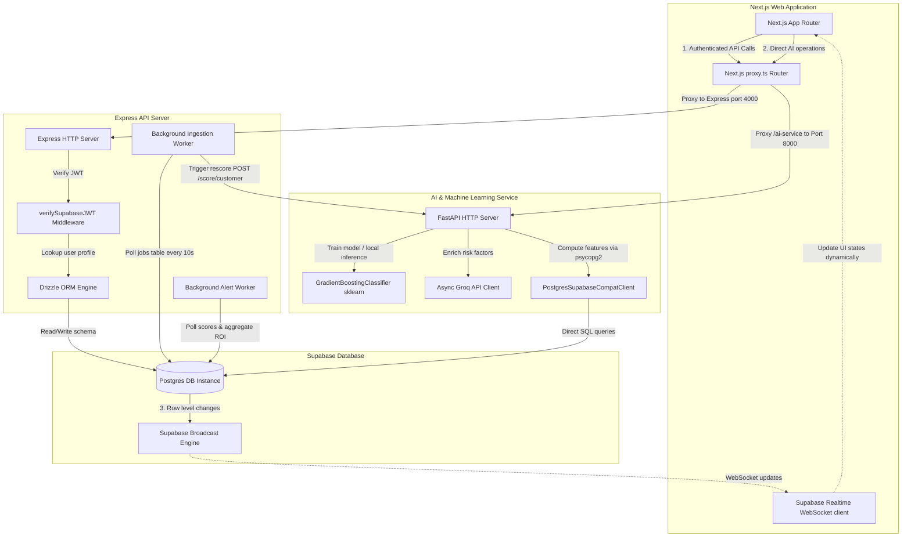

# 🔮 RetentIQ (retentiq.io) — Churn Intelligence Monorepo

RetentIQ is a state-of-the-art, enterprise SaaS customer churn-intelligence and health-scoring platform. It empowers Customer Success Teams by predicting churn risks using a hybrid machine learning classifier combined with LLM qualitative risk factors.

The system is built as a highly performant, type-safe full-stack monorepo featuring a **Next.js 16+** standalone dashboard, a **Node.js Express** API server, a **Python FastAPI** AI microservice, and a **Supabase (PostgreSQL)** database backend.

---

## 🏗️ System Architecture

The following diagram illustrates how the frontend, API server, Python AI service, and Supabase database communicate in real-time.



---

## 📂 Directory Structure

```text
/retentiq
  ├── /apps
  │     ├── /web          ← Next.js 16+ standalone (App Router, Tailwind 4, Framer Motion)
  │     ├── /api          ← Node.js + Express.js API (ESM, TypeScript, Vitest)
  │     └── /ai-service   ← Python 3.12 FastAPI microservice (GROQ AI, sklearn model, psycopg2)
  ├── /packages
  │     ├── /db           ← Supabase schema, migrations, Drizzle schemas, and seeds
  │     └── /shared       ← Common TypeScript interfaces & schemas shared across apps
  └── .env.local          ← Global environment configuration
```

---

## ⚙️ Core Technical Capabilities

### 1. Hybrid Churn Risk Intelligence Model

- **Scikit-Learn Classifier**: Trains a local `GradientBoostingClassifier` on customer event distributions (login frequencies, ticket volumes, feature adoption, and billing failures) to predict mathematical churn probabilities and health scores.
- **Groq LLM Enrichment**: Complements the ML predictions by generating 2-3 specific qualitative risk factors and recommended playbook actions based on computed metrics.

### 2. Asynchronous Ingestion & Job Queue

- **Database-backed Queue**: Webhook endpoints (Stripe, Intercom), CSV uploads, and Mixpanel sync operations append jobs to the database queue rather than executing synchronously.
- **Ingestion Worker**: A background worker polls the `jobs` table every 10 seconds, processing payloads asynchronously and freeing the Express request thread.

### 3. ROI Aggregations & Alerting Engine

- **Cached Monthly Aggregates**: An hourly cron aggregation worker calculates saved customer accounts and revenue (MRR) dynamically, caching results in the `roi_aggregates` table for lightning-fast frontend queries.
- **Proactive Alerts Delivery**: Scans health scores against user thresholds, triggering Slack webhooks and SMTP email alerts for critical accounts once every 24 hours.

---

## 🔧 Environment Variables Reference

A standard `.env.local.example` and `.env.example` are provided at the root workspace. Below is the configuration matrix:

| Env Variable Name                   | Scope / App   | Description                                    | Default / Example Value       |
| :---------------------------------- | :------------ | :--------------------------------------------- | :---------------------------- |
| `PORT`                              | Web / App     | Main application web portal runtime port       | `3000`                        |
| `API_PORT`                          | API           | Port for Express REST API to bind to locally   | `4000`                        |
| `NODE_ENV`                          | Global        | Runtime environment mode                       | `development` \| `production` |
| `NEXT_PUBLIC_APP_URL`               | Global        | Canonical URL of the Next.js frontend          | `http://localhost:3000`       |
| `NEXT_PUBLIC_API_URL`               | Web           | Client-side API root path endpoint             | `http://localhost:4000/api`   |
| `AI_SERVICE_URL`                    | API / Web     | FastAPI AI microservice URL                    | `http://localhost:8000`       |
| `DATABASE_URL`                      | DB / API / AI | Supavisor pooler connection string (Port 6543) | `postgresql://...`            |
| `DIRECT_URL`                        | DB            | Direct Postgres connection string (Port 5432)  | `postgresql://...`            |
| `SUPABASE_URL`                      | API / AI      | Supabase backend URL                           | `http://localhost:54321`      |
| `SUPABASE_ANON_KEY`                 | Web           | Supabase public anonymous client key           | `eyJhbGciOiJIUzI1Ni...`       |
| `SUPABASE_SERVICE_ROLE_KEY`         | API / AI      | Supabase admin secret key                      | `eyJhbGciOiJIUzI1Ni...`       |
| `GROQ_API_KEY`                      | AI            | API Key for Groq Cloud LLM                     | `gsk_...`                     |
| `STRIPE_SECRET_KEY`                 | API           | Secret Key for Stripe client API queries       | `sk_test_...`                 |
| `STRIPE_WEBHOOK_SECRET`             | API           | Stripe webhook signing secret key              | `whsec_...`                   |
| `INTERCOM_CLIENT_SECRET`            | API           | Intercom webhook secret for verification       | `your-intercom-secret`        |
| `MIXPANEL_SERVICE_ACCOUNT_USERNAME` | API           | Mixpanel SA username for ingestion sync        | `sa-user`                     |
| `MIXPANEL_SERVICE_ACCOUNT_SECRET`   | API           | Mixpanel SA secret key for authentication      | `sa-secret`                   |
| `SLACK_WEBHOOK_URL`                 | API           | Webhook endpoint for team Slack alerts         | `https://hooks.slack.com/...` |
| `SMTP_HOST`                         | API / Web     | Transactional email provider mail server host  | `smtp.mailtrap.io`            |
| `SMTP_PORT`                         | API / Web     | Transactional email provider port              | `2525`                        |
| `SMTP_USER`                         | API / Web     | Transactional email provider username          | `your-smtp-user`              |
| `SMTP_PASS`                         | API / Web     | Transactional email provider password          | `your-smtp-password`          |
| `CRON_SECRET`                       | API           | Token key to secure cron trigger paths         | `your-32-chars-secret`        |

---

## 🔗 Feature Synchronization & Data Normalization

Both the Node.js API and the Python AI service implement the same feature extraction algorithms to guarantee zero data drift. The following **13 key properties** are evaluated:

| Feature Name              | Type     | Description                                                     |
| :------------------------ | :------- | :-------------------------------------------------------------- |
| `login_frequency_30d`     | `float`  | Logins in the last 30 days divided by 30                        |
| `login_frequency_14d`     | `float`  | Logins in the last 14 days divided by 14                        |
| `login_frequency_7d`      | `float`  | Logins in the last 7 days divided by 7                          |
| `feature_adoption_score`  | `float`  | Distinct features utilized / 12 (features breadth)              |
| `usage_trend`             | `float`  | Week-over-Week usage trend change percentage (WoW logins)       |
| `days_since_last_login`   | `int`    | Days since the last login event (defaults to 999 if inactive)   |
| `support_ticket_volume`   | `int`    | Count of tickets opened in the last 30 days                     |
| `support_sentiment_score` | `float`  | Average customer support conversation sentiment (-1.0 to 1.0)   |
| `billing_events`          | `int`    | Count of failed payments or plan changes to churned             |
| `onboarding_time`         | `float`  | Days between account creation and the first recorded user event |
| `nps_csat_score`          | `float`  | Latest Net Promoter Score from CRM integrations (0-10)          |
| `renewal_proximity`       | `float`  | Days remaining until contract renewal date                      |
| `plan_tier`               | `string` | Customer subscription tier (Basic, Pro, Enterprise)             |

---

## 🛠️ Workspace Setup & Local Execution

### 1. Installation

Install workspace dependencies from the root directory:

```bash
pnpm install
```

Build shared packages and applications:

```bash
pnpm build
```

### 2. Environment Configurations

1. Copy the environment variables template in the root directory:
   ```bash
   cp .env.local.example .env.local
   ```
2. Configure active connection keys, database URLs, and API keys.

### 3. Database Initialization & Migrations

#### Local Supabase CLI Setup

1. Launch local Docker-backed Supabase stack:
   ```bash
   npx supabase start
   ```
2. Push Drizzle schema migrations to the database instance:
   ```bash
   pnpm --filter @retentiq/db db:push
   ```
3. Run the database seed script to populate customers and activity events:
   ```bash
   pnpm seed
   ```

### 4. Running the Services

#### Express API & Next.js Frontend

```bash
pnpm dev
```

- **Frontend App**: `http://localhost:3000`
- **Express REST API**: `http://localhost:4000/api`
- **Health Check**: `GET http://localhost:4000/health`

#### Python AI Service

Activate your virtual environment and start the FastAPI uvicorn daemon:

```bash
cd apps/ai-service
.venv\Scripts\activate
pip install -r requirements.txt
python main.py
```

- **FastAPI AI Server**: `http://localhost:8000`
- **AI Health Status**: `GET http://localhost:8000/health`

---

## 🧪 Testing & Verification

### 1. API Route Testing

Run Vitest unit tests:

```bash
pnpm --filter @retentiq/api test
```

### 2. Docker Orchestration

Verify multi-container builds and healthchecks locally:

```bash
docker compose up --build
```

---

## 📝 REST API Endpoints Quick Reference

### 1. Health Status

- **Endpoint**: `GET /health`
- **Access**: Public
- **Response**:
  ```json
  {
    "status": "ok",
    "version": "1.0.0",
    "uptime": 124,
    "db": "ok"
  }
  ```

### 2. Customer Health Scoring

- **Endpoint**: `POST /score/customer`
- **Headers**: `Authorization: Bearer <Supabase_JWT>`
- **Payload**:
  ```json
  {
    "customer_id": "00000000-0000-0000-0000-000000000001",
    "org_id": "00000000-0000-0000-0000-000000000001"
  }
  ```

---

## 🤝 Open Source Contribution Guidelines

Contributions are welcome! Please follow these standards:

1. **Branch Naming**:
   - Features: `feat/feature-name`
   - Bug Fixes: `fix/bug-name`
   - Documentation: `docs/doc-name`
2. **Code Style**:
   - Standardized ESLint and Prettier configurations are set up. Run code formatting before submitting:
     ```bash
     pnpm format
     pnpm lint
     ```
3. **Pull Requests**:
   - Ensure all tests pass.
   - Attach a screenshot or console output showing validation details where relevant.
