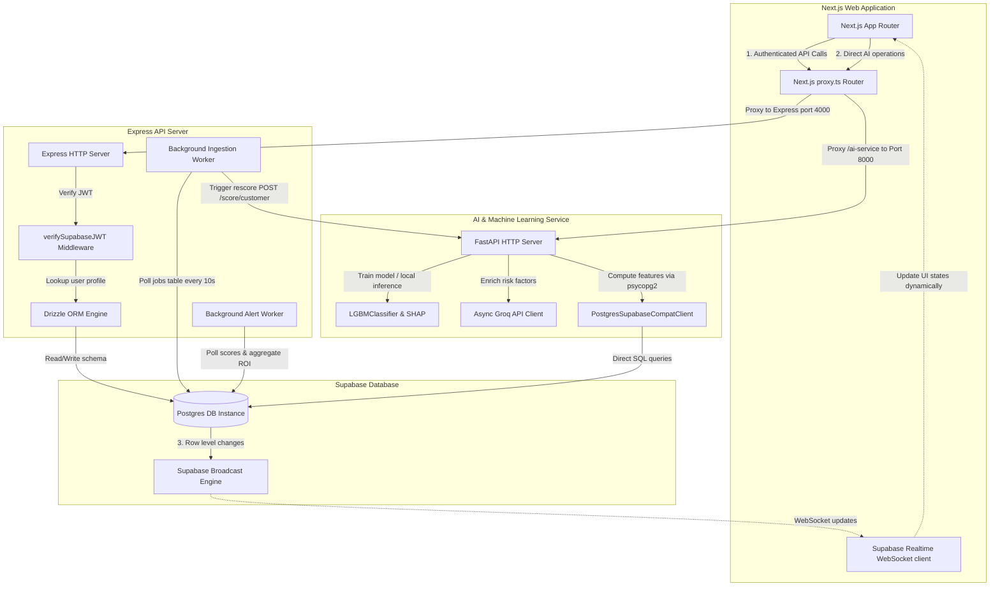
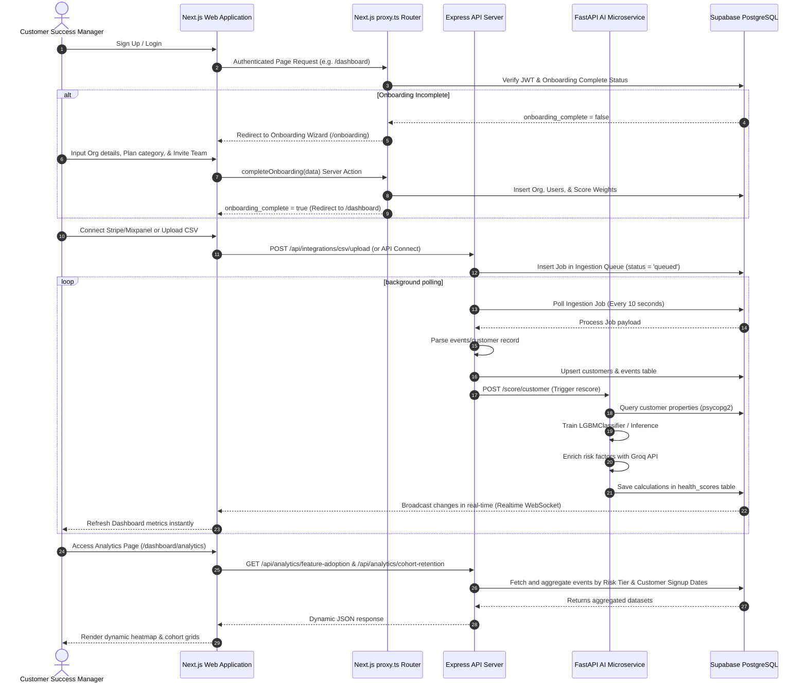

<div align="center">
  
  
  <p align="center">
    <strong>🔮 State-of-the-Art Enterprise Churn Intelligence & Health-Scoring Platform</strong>
  </p>

  <p align="center">
    <a href="#-system-architecture">Architecture</a> •
    <a href="#-core-technical-capabilities">Capabilities</a> •
    <a href="#-directory-structure">Directory Structure</a> •
    <a href="#-workspace-setup--local-execution">Setup Guide</a> •
    <a href="#-testing--verification">Testing</a> •
    <a href="#-security-compliance--privacy">Security & Compliance</a>
  </p>

  <p align="center">
    
    
    
    
    
  </p>
</div>

---

## 🔮 Overview

RetentIQ is an enterprise-grade SaaS customer churn-intelligence and health-scoring platform. It empowers Customer Success (CS) and Account Management teams by predicting customer churn risks 30–60 days before they happen. The system combines a local **LightGBM Machine Learning Classifier** with **SHAP explanations** (telemetry-based quantitative scoring grounded in model computation) and **Llama-3.3 LLM Qualitative Analysis** (natural language risk factors and dynamic playbooks) to deliver highly actionable account recovery strategies.

RetentIQ is architected as a type-safe, high-performance monorepo:

- **Next.js 16+ (Standalone)**: A performant, responsive frontend utilizing Turbopack, Framer Motion, and Tailwind CSS.
- **Node.js Express API Server**: An ESM-based, type-safe API backend using Drizzle ORM.
- **FastAPI AI Microservice**: A high-throughput Python service executing ML inference and LLM orchestrations.
- **Supabase (PostgreSQL)**: Robust data persistence backed by Row Level Security (RLS) and real-time subscription broadcasts.

---

## 🏗️ System Architecture

The diagram below illustrates the real-time communication flow across the full-stack architecture layers:



### 🔮 System Workflow Sequence

The sequence diagram below traces the end-to-end user lifecycle, asynchronous ingestion queue, and real-time health updates:



---

## ⚙️ Core Technical Capabilities

### 1. Hybrid Churn Risk Predictive Model

- **Quantitative Inference**: Evaluates customer behavioral telemetry using a locally compiled LightGBM Classifier (`LGBMClassifier`) trained on historical login frequency, feature adoption depth, billing trends, and support ticket parameters, with feature attributions calculated using `SHAP` values.
- **Qualitative Risk Synthesis**: Uses Groq LLM API integrations (Llama-3.3) to translate mathematical predictions into natural language risk explanations and actionable playbooks.

### 2. Asynchronous Ingestion & Database-backed Queue

- **Thread Safety**: Long-running ingestion jobs (such as manual CSV parsing, Stripe billing syncs, or Mixpanel telemetry calls) are stored in a relational `jobs` queue to prevent API blocking.
- **Background Worker**: A dedicated ingestion daemon polls the queue every 10 seconds to execute normalizations, rescore computations, and status updates asynchronously.

### 3. ROI Metric Caching & Audited Alerting

- **Cached Monthly Aggregates**: Complex SQL aggregates (measuring total MRR saved, CS team action success rates, and ROI) are computed hourly via a background cron task and cached in the `roi_aggregates` table to ensure <100ms dashboard queries.
- **Automated Dispatching**: Dispatches automated email digests and real-time Slack webhooks when customer health drops below defined alert thresholds.

---

## 📂 Directory Structure

```text
/retentiq
  ├── /apps
  │     ├── /web          ← Next.js 16+ Web Dashboard (Turbopack, Tailwind CSS 4, Framer Motion)
  │     ├── /api          ← Express REST Backend (ESM, TypeScript, Vitest, PostgreSQL pooler)
  │     └── /ai-service   ← Python 3.12 FastAPI microservice (Scikit-Learn, Groq Llama-3.3, psycopg2)
  ├── /packages
  │     ├── /db           ← Drizzle ORM schema, seeds, and local migrations
  │     └── /shared       ← Monorepo-wide shared TypeScript types, interfaces, and schemas
  ├── .lighthouserc.json  ← Lighthouse Audit Assertions configuration
  └── .env.local.example  ← Standard template environment configuration
```

---

## 🔧 Environment Variables Reference

| Variable Name               | Scope         | Description                                    | Example Value                 |
| :-------------------------- | :------------ | :--------------------------------------------- | :---------------------------- |
| `PORT`                      | Web           | Main web application runtime port              | `3000`                        |
| `API_PORT`                  | API           | Local port for the Express REST API            | `4000`                        |
| `NODE_ENV`                  | Global        | System execution environment mode              | `development` \| `production` |
| `NEXT_PUBLIC_APP_URL`       | Global        | Canonical URL of the frontend portal           | `http://localhost:3000`       |
| `NEXT_PUBLIC_API_URL`       | Web           | Client-side API root path endpoint             | `http://localhost:4000/api`   |
| `AI_SERVICE_URL`            | API / Web     | Connection URL for the FastAPI microservice    | `http://localhost:8000`       |
| `DATABASE_URL`              | DB / API / AI | Supavisor pooler connection string (Port 6543) | `postgresql://...`            |
| `DIRECT_URL`                | DB            | Direct Postgres connection string (Port 5432)  | `postgresql://...`            |
| `SUPABASE_URL`              | API / AI      | Supabase project console instance URL          | `http://localhost:54321`      |
| `SUPABASE_ANON_KEY`         | Web           | Supabase client anonymous public key           | `eyJhbGciOiJIUzI1Ni...`       |
| `SUPABASE_SERVICE_ROLE_KEY` | API / AI      | Supabase service role secret admin key         | `eyJhbGciOiJIUzI1Ni...`       |
| `GROQ_API_KEY`              | AI            | API authentication token for Groq Cloud        | `gsk_...`                     |
| `SLACK_WEBHOOK_URL`         | API           | Webhook endpoint for team Slack alerts         | `https://hooks.slack.com/...` |
| `SMTP_HOST`                 | API           | Outgoing email SMTP server hostname            | `smtp.mailtrap.io`            |
| `SMTP_PORT`                 | API           | Outgoing email SMTP port                       | `2525`                        |

---

## 🛠️ Workspace Setup & Local Execution

### 1. Prerequisite Installations

Ensure you have Node.js 20+, Python 3.12+, and Docker running locally.

Install workspace dependencies:

```bash
pnpm install
```

Compile packages and static build assets:

```bash
pnpm build
```

### 2. Configure Environment Variables

Copy the template configuration and populate your API credentials:

```bash
cp .env.local.example .env.local
```

### 3. Local Supabase CLI & Migrations

1. Initialize and run the local Docker-backed Supabase stack:
   ```bash
   npx supabase start
   ```
2. Apply Drizzle database migrations:
   ```bash
   pnpm --filter @retentiq/db db:push
   ```
3. Run the DB seed script to generate mock customers, events, and metrics:
   ```bash
   pnpm seed
   ```

### 4. Running Services Locally

Start Next.js and the Express API server concurrently:

```bash
pnpm dev
```

- Frontend: `http://localhost:3000`
- API Backend: `http://localhost:4000/api`
- Health check endpoint: `GET http://localhost:4000/health`

Start the Python FastAPI AI microservice:

```bash
cd apps/ai-service
.venv\Scripts\activate
pip install -r requirements.txt
python main.py
```

- FastAPI microservice: `http://localhost:8000`

---

## 🧪 Testing & Verification

### 1. API Route Testing

RetentIQ enforces Vitest suite coverage checks. Run unit and integration tests locally:

```bash
pnpm --filter @retentiq/api test
```

Generate a local coverage report:

```bash
pnpm --filter @retentiq/api test -- --coverage
```

### 2. AI Service Model Testing

Run local Python scikit-learn and LightGBM model prediction/classification tests:

```bash
pnpm test:ai
```

### 3. Performance Auditing (Lighthouse CI)

Run local Lighthouse assertion checks on built artifacts:

```bash
npx @lhci/cli autorun
```

### 3. Docker Compose Orchestration

Verify multi-container orchestrations, networks, and Docker health checks:

```bash
docker compose up --build
```

---

## 🔒 Security, Compliance & Privacy

RetentIQ is built from the ground up to support strict enterprise data governance standards:

- **Row-Level Security (RLS)**: Enforces complete isolation at the database level. Customer telemetry and user details are only accessible to verified members of the corresponding tenant organization (`org_id`).
- **Cryptographic Transit**: All API requests, Supabase database connections, and WebSocket subscription streams require SSL/TLS in transit.
- **LLM Privacy**: Data sent to the Llama-3.3 model on Groq is anonymized. No personally identifiable customer information (PII) is transmitted.

---

## 🤝 Contribution Guidelines

We follow strict enterprise-level software engineering conventions:

1. **Branch Model**:
   - Features: `feat/feature-name`
   - Patches/Fixes: `fix/bug-name`
   - Chore/Documentation: `chore/doc-name`
2. **Coding Standards**:
   - Format all files with Prettier (`pnpm format`) and lint (`pnpm lint`) before opening a PR.
3. **Pull Request Validation**:
   - All code updates require passing CI pipelines (including unit tests, linter, TypeScript compiler checks, and Lighthouse performance assertions).
