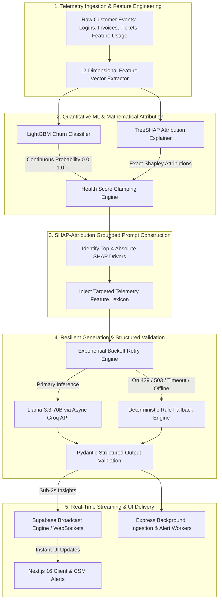

<div align="center">
  

# RetentIQ

  <p align="center">
    <strong>Open-Source Predictive Churn Intelligence & Customer Health Scoring Platform</strong><br />
    Deterministic LightGBM inference, game-theoretic TreeSHAP explainability, and resilient LLM playbooks.
  </p>

  <p align="center">
    <a href="https://retentiq-chi.vercel.app/login?guest=true"><strong>⚡ Launch Instant Live Sandbox (1-Click, No Signup) »</strong></a>
  </p>

  <p align="center">
    <a href="#-why-retentiq">Why RetentIQ</a> •
    <a href="#-enterprise-comparison">Gainsight vs Totango vs RetentIQ</a> •
    <a href="#-ai--machine-learning-architecture">AI Architecture</a> •
    <a href="#-guest-sandbox--demo">Guest Sandbox</a> •
    <a href="#-monorepo-layout">Monorepo Layout</a> •
    <a href="#-quickstart--local-development">Quickstart</a> •
    <a href="#-testing--verification">Testing</a> •
    <a href="#-security--governance">Security</a>
  </p>

  <p align="center">
    
    
    
    
    
    
    
    
  </p>
</div>

---

## ⚡ Try It Right Now

Skip the clone and evaluate RetentIQ immediately with zero registration:

👉 **[Launch Interactive Guest Sandbox (`https://retentiq-chi.vercel.app/login?guest=true`)](https://retentiq-chi.vercel.app/login?guest=true)**

- **1-Click Authentication:** Auto-provisions an isolated, real-time workspace.
- **50 Pre-Seeded Enterprise Accounts:** Balanced across all 4 health tiers (`Low`, `Medium`, `High`, `Critical`).
- **Live Telemetry & Diagnostics:** Inspect real-time 12-dimensional feature attributions, model confidence scores, and dynamic retention playbooks.

---

## 💡 Why RetentIQ?

Most modern "AI-powered" retention tools are either:

1. **Trivial LLM wrappers:** Raw event logs are blindly concatenated into an LLM prompt, producing hallucinated health scores, non-deterministic predictions, and unsustainable API costs.
2. **Legacy enterprise CS monoliths:** Systems like Gainsight or Totango that require 6-month sales cycles, cost $25k–$50k+/year, rely on manual rule heuristics, and offer zero model transparency.

**RetentIQ bridges this gap with a principled, two-tier hybrid architecture:**

- **Quantitative Scoring Belongs to Deterministic ML:** Numerical churn probabilities ($0.0 \le p \le 1.0$) and baseline health scores ($0 \le s \le 100$) are calculated deterministically by an in-process **LightGBM Gradient Boosted Decision Tree (GBDT)** classifier.
- **Feature Attribution Belongs to Game Theory:** **TreeSHAP** computes exact Shapley attributions across 12 behavioral dimensions, mathematically proving _why_ an account is at risk (e.g. dropped usage slope vs. billing invoice failures).
- **Qualitative Playbooks Belong to LLMs:** High-throughput LLMs (Llama-3.3-70B via Groq) synthesize structured account recovery steps grounded directly in top mathematical risk drivers.
- **Guaranteed Reliability:** If external LLM APIs fail or rate limit, an in-process deterministic rule engine provides instant offline fallback with 100% uptime.

---

## 📊 Enterprise Comparison

| Feature                          |               Gainsight                |              Totango              |                                      RetentIQ (Open Source)                                       |
| :------------------------------- | :------------------------------------: | :-------------------------------: | :-----------------------------------------------------------------------------------------------: |
| **License & Code Transparency**  |      Proprietary / Closed Source       |    Proprietary / Closed Source    |                           **MIT Open Source (Full code transparency)**                            |
| **Annual Starting Cost**         |         ~$25,000 – $60,000+/yr         |      ~$18,000 – $40,000+/yr       |                               **$0 (Self-Hosted) / Free to Deploy**                               |
| **Evaluation Experience**        | Multi-week sales qualification & demos | Gated sales cycle & trial hurdles | **[1-Click Instant Guest Sandbox](https://retentiq-chi.vercel.app/login?guest=true) (No signup)** |
| **Predictive ML Engine**         |      Black-box proprietary rules       |    Heuristic scorecard weights    |                          **LightGBM Classifier (Trained on telemetry)**                           |
| **Attribution & Explainability** |         Opaque health scoring          |     Manual scorecard metrics      |                          **TreeSHAP (Exact Shapley value per feature)**                           |
| **AI Action Playbooks**          |       Manual checklist playbooks       |     Template-driven playbooks     |                          **Dynamic LLM Playbooks (Llama-3.3 via Groq)**                           |
| **Offline Fallback Engine**      |         None (SaaS dependent)          |       None (SaaS dependent)       |                           **Deterministic In-Process Fallback Engine**                            |
| **Extensibility & Schema**       |      Rigid enterprise data model       |    Rigid enterprise data model    |                           **Type-safe Drizzle ORM + Next.js + FastAPI**                           |

---

## 🧠 AI & Machine Learning Architecture

RetentIQ separates quantitative statistical computation from qualitative language generation:


```mermaid
graph TD
    %% Telemetry Layer
    subgraph Telemetry [1. Telemetry Ingestion & Feature Engineering]
        RawEvents[Raw Customer Events: Logins, Invoices, Tickets, Feature Usage]
        FeatureEngine[12-Dimensional Feature Vector Extractor]
        RawEvents --> FeatureEngine
    end

    %% Quantitative ML Layer
    subgraph MLInference [2. Quantitative ML & Mathematical Attribution]
        Classifier[LightGBM Churn Classifier]
        TreeSHAP[TreeSHAP Attribution Explainer]
        ScoreClamping[Health Score Clamping Engine]
        FeatureEngine --> Classifier
        FeatureEngine --> TreeSHAP
        Classifier -->|Continuous Probability 0.0 - 1.0| ScoreClamping
        TreeSHAP -->|Exact Shapley Attributions| ScoreClamping
    end

    %% Context Grounding Layer
    subgraph PromptGrounding [3. SHAP-Attribution Grounded Prompt Construction]
        TopDrivers[Identify Top-4 Absolute SHAP Drivers]
        DynamicLexicon[Inject Targeted Telemetry Feature Lexicon]
        ScoreClamping --> TopDrivers
        TopDrivers --> DynamicLexicon
    end

    %% Generation & Fallback Layer
    subgraph LLMExecution [4. Resilient Generation & Structured Validation]
        GroqLLM[Llama-3.3-70B via Async Groq API]
        RetryEngine[Exponential Backoff Retry Engine]
        OfflineFallback[Deterministic Rule Fallback Engine]
        PydanticSchema[Pydantic Structured Output Validation]

        DynamicLexicon --> RetryEngine
        RetryEngine -->|Primary Inference| GroqLLM
        RetryEngine -.->|On 429 / 503 / Timeout / Offline| OfflineFallback
        GroqLLM --> PydanticSchema
        OfflineFallback --> PydanticSchema
    end

    %% Real-time Delivery Layer
    subgraph Delivery [5. Real-Time Streaming & UI Delivery]
        RealtimeBroadcast[Supabase Broadcast Engine / WebSockets]
        DashboardUI[Next.js 16 Client & CSM Alerts]
        JobQueue[Express Background Ingestion & Alert Workers]

        PydanticSchema -->|Sub-2s Insights| RealtimeBroadcast
        PydanticSchema --> JobQueue
        RealtimeBroadcast -.->|Instant UI Updates| DashboardUI
    end
```

### Core Engineering Decisions

1. **Deterministic Churn Probability (LightGBM)**:
   - Evaluates a 12-dimensional vector: `login_frequency_30d`, `login_frequency_14d`, `login_frequency_7d`, `feature_adoption_score`, `usage_trend`, `days_since_last_login`, `support_ticket_volume`, `support_sentiment_score`, `billing_events`, `onboarding_time`, `nps_csat_score`, and `renewal_proximity`.
   - Produces a calibrated probability between $0.0$ and $1.0$ without invoking external APIs.

2. **Game-Theoretic Attribution (TreeSHAP)**:
   - TreeSHAP calculates the exact marginal contribution ($\phi_i$) of each telemetry feature to the customer's churn probability.
   - Positive SHAP values indicate risk drivers; negative SHAP values indicate retention anchors.

3. **SHAP-Attribution Grounded Prompting**:
   - Rather than passing unstructured data, the top 4 mathematical risk drivers are isolated and paired with a focused telemetry lexicon before prompting Groq.
   - Grounded context prevents hallucination and ensures LLM recommendations directly target root causes.

4. **Strict Pydantic Output Contracts**:
   - Responses are strictly validated via Pydantic schemas (`HealthScoreOutput`, `PlaybookResponse`, `PlaybookStep`).
   - Automated fence-stripping, JSON repair, and numeric clamping guarantee that frontend consumers never receive malformed payloads.

5. **In-Process Deterministic Fallback Engine**:
   - If the Groq API encounters rate limits (429), server errors (503), or network timeouts, the system gracefully degrades to an in-process deterministic fallback engine (`get_fallback_with_sklearn` & rule heuristics), maintaining 100% system availability.

---

## ⚡ Guest Sandbox & Demo

Anyone can immediately test drive the complete RetentIQ platform without creating an account or providing API keys:

👉 **[Open Live Sandbox: `/login?guest=true`](https://retentiq-chi.vercel.app/login?guest=true)**

### What Happens Behind the Scenes:

1. **Instant Session Provisioning:** Creates or resets a temporary demo account (`guest.recruiter@retentiq.io`) backed by Supabase Auth.
2. **Automated Data Seeding:** Injects 50 synthetic enterprise customer accounts into an isolated workspace (`seedGuestWorkspace.ts`).
3. **Multi-Tier Risk Distribution:** Accounts are distributed across `Low Risk` (80–100 health score), `Medium Risk` (50–79), `High Risk` (25–49), and `Critical Risk` (<25) tiers.
4. **Interactive CSM Diagnostics:** Open any customer account to view live TreeSHAP attribution charts, calculate real-time ML risk scores, and trigger on-demand Llama-3.3 playbook generation.

---

## 📁 Monorepo Layout

```
RetentIQ/
├── apps/
│   ├── api/                  # Express REST API Server (Node 20, TypeScript, Drizzle ORM, Pino)
│   │   ├── src/lib/          # Structured logger, typed errors, alert rules, crypto utilities
│   │   └── src/workers/      # Background ingestion & alert dispatch queue workers
│   ├── web/                  # Next.js 16 App Router UI (React 19, Tailwind CSS, Framer Motion)
│   │   ├── src/app/          # Dashboard routes, auth handlers, and public marketing pages
│   │   ├── src/components/   # Modular UI components, charts, and interactive drawers
│   │   └── src/lib/          # Client API services, guest workspace seeding, and Supabase client
│   └── ai-service/           # FastAPI Machine Learning Microservice (Python 3.11+)
│       ├── routers/          # Modular endpoints (scoring, explain, playbook, legacy)
│       ├── classifier.py     # LightGBM churn model & TreeSHAP explainer engine
│       ├── feature_engine.py # 12-dimensional telemetry feature extractor
│       ├── scoring.py        # Health score clamping, weights, and deterministic fallbacks
│       ├── prompts.py        # SHAP-grounded telemetry lexicons and prompt templates
│       ├── services.py       # Async Groq client with exponential backoff & Supabase client
│       └── tests/            # Automated Pytest suite (39 tests, >70% coverage gate)
├── packages/
│   ├── db/                   # Drizzle ORM schema, migrations, and database seed scripts
│   └── shared/               # Shared TypeScript types, validation schemas, and constants
├── docs/
│   ├── AI_ARCHITECTURE.md    # Detailed AI & Machine Learning whitepaper
│   ├── MODEL_CARD.md         # ML model specification, fairness, and feature taxonomy
│   └── REPRODUCIBILITY.md    # Training seed, environment setup, and benchmark reproducibility
├── docker-compose.yml        # Multi-service containerization config
├── pnpm-workspace.yaml       # Monorepo package topology definition
└── CHANGELOG.md              # Historical version records
```

---

## 🛠️ Quickstart & Local Development

### Prerequisites

- **Node.js:** `20.x LTS`
- **Package Manager:** `pnpm 10.x`
- **Python:** `3.11+`
- **Database:** Supabase project or local PostgreSQL instance

### 1. Clone & Install Dependencies

```bash
git clone https://github.com/apoorvmaurya/retentiq.git
cd retentiq

# Install monorepo Node dependencies
pnpm install

# Setup Python virtual environment for AI microservice
cd apps/ai-service
python -m venv .venv

# On Windows (PowerShell):
.venv\Scripts\Activate.ps1
# On Linux/macOS:
source .venv/bin/activate

pip install -r requirements.txt
cd ../..
```

### 2. Environment Configuration

Copy the example environment configuration:

```bash
cp .env.example .env
```

Populate the required keys in `.env` (Supabase URL, Service Role Key, and Groq API Key).

### 3. Launch the Stack

Run the web frontend and API server concurrently:

```bash
pnpm dev
```

In a second terminal, activate the virtual environment and start the AI microservice:

```bash
cd apps/ai-service
python main.py
```

### Service Map

| Service                       |  Port  | Endpoint                     |
| :---------------------------- | :----: | :--------------------------- |
| **Web Frontend (Next.js 16)** | `3000` | `http://localhost:3000`      |
| **API Server (Express)**      | `4000` | `http://localhost:4000/api`  |
| **AI Microservice (FastAPI)** | `8000` | `http://localhost:8000`      |
| **Interactive OpenAPI Docs**  | `8000` | `http://localhost:8000/docs` |

---

## 🧪 Testing & Verification

RetentIQ enforces rigorous automated testing across the entire monorepo:

```bash
# 1. Typecheck the entire monorepo (Shared, DB, API, Web)
pnpm typecheck

# 2. Run web frontend test suite (Vitest + JSDOM)
pnpm test:web

# 3. Run API server test suite (Vitest + Supertest)
pnpm test:api

# 4. Run AI microservice test suite (Pytest + AsyncIO)
pnpm test:ai
# or:
pytest apps/ai-service/tests -v

# 5. Full workspace verification & test coverage
pnpm test
pnpm test:coverage
pnpm build
```

---

## 🔒 Security & Multi-Tenancy

- **Row Level Security (RLS):** Database queries are isolated per organization at the PostgreSQL layer using Supabase RLS.
- **Application-Layer Encryption:** Third-party integration credentials (Stripe, Slack webhooks) are encrypted at rest using AES-256-GCM.
- **Zero PII Exposure:** Telemetry transmitted to LLMs is strictly pseudonymized; customer names, emails, and sensitive user identifiers are stripped before inference.
- **Dependency Auditing:** Automated CI security scanning via `gitleaks`, `pnpm audit`, and `pip-audit`.

---

## 📄 License

This project is licensed under the [MIT License](LICENSE).
