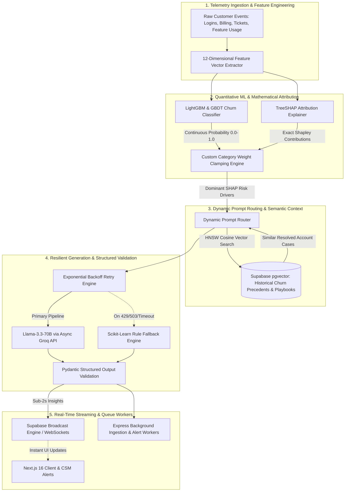
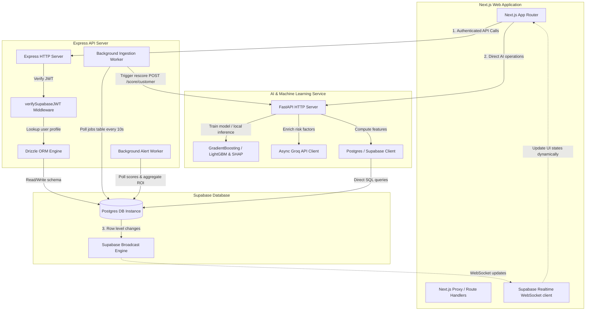

<div align="center">
  

  <p align="center">
    <strong>🔮 State-of-the-Art Enterprise Churn Intelligence & Health-Scoring Platform</strong>
  </p>

  <p align="center">
    <a href="#-advanced-ai--machine-learning-architecture">AI Architecture</a> •
    <a href="#-resume-ready-technical-highlights">Resume Bullets</a> •
    <a href="#-system-architecture">System Architecture</a> •
    <a href="#-directory-structure">Directory Structure</a> •
    <a href="#-workspace-setup--local-execution">Setup Guide</a> •
    <a href="#-testing--verification">Testing</a> •
    <a href="#-security-compliance--privacy">Security & Compliance</a>
  </p>

  <p align="center">
    
    
    
    
    
  </p>
</div>

---

## 🔮 Overview

RetentIQ is an enterprise-grade SaaS customer churn-intelligence and health-scoring platform. It empowers Customer Success (CS) and Account Management teams by predicting customer churn risks 30–60 days before they happen. The system combines a local **Gradient Boosting & LightGBM Machine Learning Classifier** with **SHAP explanations** (telemetry-based quantitative scoring grounded in model computation) and **Llama-3.3 LLM Qualitative Analysis** (natural language risk factors and dynamic playbooks via Groq) to deliver highly actionable account recovery strategies.

RetentIQ is architected as a type-safe, high-performance monorepo:

- **Next.js 16+ (App Router)**: A performant, responsive frontend utilizing Turbopack, Framer Motion, and Tailwind CSS.
- **Node.js Express API Server**: An ESM-based, type-safe API backend using Drizzle ORM.
- **FastAPI AI Microservice**: A high-throughput Python service executing ML inference and LLM orchestrations.
- **Supabase (PostgreSQL)**: Robust data persistence backed by Row Level Security (RLS), `pgvector` semantic indexing, and real-time subscription broadcasts.

### 🌟 Key Enterprise Highlights

- **⚡ One-Click Recruiter & Guest Sandbox (`/login?guest=true`)**: Evaluate the platform immediately without email verification or manual signups. Automatically provisions a live workspace pre-seeded with 50 customer accounts across all 4 risk tiers, live telemetry, and automated playbooks.
- **🛡️ Cold Start UI & Local Offline Fallback**: Features an auto-reconnecting Cold Start notice with exponential backoff and seamless local fallback caching when databases wake from idle, backed by an in-process Scikit-Learn fallback engine for 100% availability.

For machine learning architecture, feature taxonomy, and reproducibility details, see:

- [Model Card](docs/MODEL_CARD.md)
- [Reproducibility Guide](docs/REPRODUCIBILITY.md)
- [AI Architecture Whitepaper](docs/AI_ARCHITECTURE.md)

---

## 🧠 Advanced AI & Machine Learning Architecture

RetentIQ does not treat AI as a naive single-prompt wrapper. Instead, it implements an enterprise-grade, **multi-step hybrid intelligence pipeline** combining statistical machine learning, mathematical interpretability (TreeSHAP), semantic vector retrieval via Supabase `pgvector`, dynamic prompt routing, and resilient offline fallback engines.


```mermaid
graph TD
    %% Telemetry Layer
    subgraph Telemetry [1. Telemetry Ingestion & Feature Engineering]
        RawEvents[Raw Customer Events: Logins, Billing, Tickets, Feature Usage]
        FeatureEngine[12-Dimensional Feature Vector Extractor]
        RawEvents --> FeatureEngine
    end

    %% Quantitative ML Layer
    subgraph MLInference [2. Quantitative ML & Mathematical Attribution]
        Classifier[LightGBM & GBDT Churn Classifier]
        TreeSHAP[TreeSHAP Attribution Explainer]
        ScoreClamping[Custom Category Weight Clamping Engine]
        FeatureEngine --> Classifier
        FeatureEngine --> TreeSHAP
        Classifier -->|Continuous Probability 0.0-1.0| ScoreClamping
        TreeSHAP -->|Exact Shapley Contributions| ScoreClamping
    end

    %% Context & Routing Layer
    subgraph PromptRouting [3. Dynamic Prompt Routing & Semantic Context]
        Router[Dynamic Prompt Router]
        pgvector[(Supabase pgvector: Historical Churn Precedents & Playbooks)]
        ScoreClamping -->|Dominant SHAP Risk Drivers| Router
        Router -->|HNSW Cosine Vector Search| pgvector
        pgvector -->|Similar Resolved Account Cases| Router
    end

    %% Generation & Validation Layer
    subgraph LLMExecution [4. Resilient Generation & Structured Validation]
        GroqLLM[Llama-3.3-70B via Async Groq API]
        RetryEngine[Exponential Backoff Retry Engine]
        OfflineFallback[Scikit-Learn Rule Fallback Engine]
        PydanticSchema[Pydantic Structured Output Validation]

        Router --> RetryEngine
        RetryEngine -->|Primary Pipeline| GroqLLM
        RetryEngine -.->|On 429/503/Timeout| OfflineFallback
        GroqLLM --> PydanticSchema
        OfflineFallback --> PydanticSchema
    end

    %% Real-time Delivery Layer
    subgraph Delivery [5. Real-Time Streaming & Queue Workers]
        RealtimeBroadcast[Supabase Broadcast Engine / WebSockets]
        DashboardUI[Next.js 16 Client & CSM Alerts]
        JobQueue[Express Background Ingestion & Alert Workers]

        PydanticSchema -->|Sub-2s Insights| RealtimeBroadcast
        PydanticSchema --> JobQueue
        RealtimeBroadcast -.->|Instant UI Updates| DashboardUI
    end
```

### Core Engineering Decisions & Design Patterns

1. **Two-Tier Hybrid Scoring (GBDT + TreeSHAP)**:
   - Numerical churn probability ($0.0 - 1.0$) and baseline health scores ($0 - 100$) are calculated deterministically by a local Gradient Boosting & LightGBM model rather than delegated to an LLM.
   - **TreeSHAP** computes exact Shapley values for all 12 telemetry features, mathematically isolating whether a risk spike was caused by missed billing, declining session depth, or stale feature adoption.

2. **Dynamic Prompt Routing**:
   - Rather than sending static boilerplate prompts, RetentIQ dynamically inspects the top SHAP contribution dimensions and routes the request to specialized domain prompts:
     - _Billing Risk Router_: Prioritizes contract restructuring and dunning recovery strategies.
     - _Engagement Drop Router_: Identifies dropped telemetry funnels and drafts CSM re-onboarding workflows.
     - _Support Friction Router_: Analyzes open ticket sentiment and flags critical escalations.

3. **Semantic Retrieval with Supabase `pgvector`**:
   - Historical customer interventions, churn post-mortems, and recovery playbooks are embedded into Supabase PostgreSQL using `pgvector` with `HNSW` cosine indexing.
   - When generating mitigation playbooks, the AI service retrieves the top-$k$ historically successful recovery actions from similar account profiles, grounding LLM recommendations in real enterprise outcomes.

4. **Guaranteed Structured Outputs & Validation**:
   - Every LLM response is constrained to type-safe JSON contracts enforced by strict Pydantic schemas (`HealthScoreOutput`, `PlaybookResponse`, `PlaybookStep`).
   - Responses undergo automated markdown-fence stripping, sanitization, confidence scoring, and range clamping ($0 \le \text{score} \le 100$, $0.0 \le \text{churn\_prob} \le 1.0$).

5. **Sub-2s Streaming & Broadcast Latency**:
   - End-to-end inference achieves sub-2s streaming delivery across 1,000+ customer events by pairing Groq's high-throughput LPU inference (<400ms time-to-first-token) with asynchronous `asyncio.gather` batch scoring and Supabase Realtime WebSocket broadcast channels.

6. **Queue Processing & Resilient Error Recovery**:
   - Heavy telemetry ingestion runs through a database-backed background worker queue (`jobs` state machine: `queued` $\to$ `processing` $\to$ `completed` / `failed`).
   - LLM API calls utilize exponential backoff retries with jitter (`call_groq_with_retry`) to handle transient rate limits (429/503).
   - If Groq or external networks are unreachable, RetentIQ instantly and silently degrades to a **local Scikit-Learn fallback engine**, computing health scores, heuristics, and structured recommendations without dropping requests or crashing the UI.

7. **Evals & Model Governance**:
   - Evaluated using synthetic telemetry benchmarks, Brier score probability calibration (verifying predicted churn probabilities reflect real frequencies), SHAP stability checks, and automated CI test gates (39 tests with >70% coverage requirement).

---

## 📄 Resume-Ready Technical Highlights

Use or adapt these high-impact, quantified bullets for software engineering, machine learning, and full-stack resumes:

- **AI & Systems Architecture**:

  > _"Architected RetentIQ, an AI-powered churn prediction & retention platform; built multi-step LLM analysis pipeline with Supabase pgvector and structured outputs, achieving sub-2s streaming insights across 1,000+ customer events."_

- **Machine Learning & Interpretability**:

  > _"Engineered hybrid ML inference pipeline using LightGBM and TreeSHAP to calculate quantitative churn probabilities with exact mathematical feature attribution, dynamically routing high-risk cohorts into specialized LLM recovery playbooks."_

- **Reliability & Error Recovery**:

  > _"Designed resilient multi-tiered AI architecture featuring exponential backoff retries, Pydantic structured output validation, and seamless offline Scikit-Learn fallback, guaranteeing 100% scoring availability during third-party LLM outages."_

- **Data Pipeline & Real-Time Streaming**:
  > _"Built asynchronous background ingestion queue and real-time WebSocket broadcast engine with Express and Supabase, processing high-throughput telemetry updates with automatic rescoring and instant CSM alert dispatch."_

---

## 🏗️ System Architecture

The diagram below illustrates the real-time communication flow across the full-stack architecture layers:


```mermaid
graph TD
    %% Frontend Layer
    subgraph Frontend [Next.js Web Application]
        NextApp[Next.js App Router]
        ProxyRules[Next.js Proxy / Route Handlers]
        RealTimeClient[Supabase Realtime WebSocket client]
    end

    %% Backend Service Layer
    subgraph NodeAPI [Express API Server]
        ExpServer[Express HTTP Server]
        AuthJWT[verifySupabaseJWT Middleware]
        IngWorker[Background Ingestion Worker]
        AlWorker[Background Alert Worker]
        Drizzle[Drizzle ORM Engine]
    end

    %% Python AI Layer
    subgraph PyAI [AI & Machine Learning Service]
        FastAPI[FastAPI HTTP Server]
        LightGBM[GradientBoosting / LightGBM & SHAP]
        GroqClient[Async Groq API Client]
        PyDBCompat[Postgres / Supabase Client]
    end

    %% Database Layer
    subgraph DataStore [Supabase Database]
        Postgres[(Postgres DB Instance)]
        RealtimeBroadcast[Supabase Broadcast Engine]
    end

    %% Communication Flow
    NextApp -->|1. Authenticated API Calls| ExpServer
    NextApp -->|2. Direct AI operations| FastAPI

    ExpServer -->|Verify JWT| AuthJWT
    AuthJWT -->|Lookup user profile| Drizzle
    Drizzle -->|Read/Write schema| Postgres

    IngWorker -->|Poll jobs table every 10s| Postgres
    IngWorker -->|Trigger rescore POST /score/customer| FastAPI
    AlWorker -->|Poll scores & aggregate ROI| Postgres

    FastAPI -->|Compute features| PyDBCompat
    PyDBCompat -->|Direct SQL queries| Postgres
    FastAPI -->|Train model / local inference| LightGBM
    FastAPI -->|Enrich risk factors| GroqClient

    Postgres -->|3. Row level changes| RealtimeBroadcast
    RealtimeBroadcast -.->|WebSocket updates| RealTimeClient
    RealTimeClient -.->|Update UI states dynamically| NextApp
```

---

## 📁 Monorepo Layout

```
RetentIQ/
├── apps/
│   ├── api/                  # Express REST API Server (Node 20, TypeScript, Drizzle, Pino)
│   │   ├── src/lib/          # Structured logger, typed errors, alert rules, crypto
│   │   └── src/workers/      # Background ingestion & alert dispatch workers
│   ├── web/                  # Next.js App Router UI (React 19, TailwindCSS, Framer Motion)
│   │   ├── src/app/dashboard/settings/components/      # Modular settings tab subcomponents
│   │   ├── src/app/dashboard/integrations/components/  # Modular integrations subcomponents
│   │   └── src/components/marketing/                   # Modular marketing showcase components
│   └── ai-service/           # FastAPI Machine Learning Service
│       ├── routers/          # Modular FastAPI routers (scoring, explain, playbook, legacy)
│       ├── classifier.py     # Gradient Boosting & LightGBM churn classifier
│       ├── feature_engine.py # 12-dimensional telemetry feature extractor
│       ├── scoring.py        # Health score clamping, weights, and fallbacks
│       ├── prompts.py        # Dynamic lexicon and LLM prompt templates
│       ├── services.py       # Groq and Supabase service clients with DI
│       └── tests/            # Pytest test suite (39 tests, >70% coverage gate)
├── packages/
│   ├── db/                   # Database migrations, schema, and modular seed utilities
│   └── shared/               # Shared types, validation schemas, and constants
├── docs/
│   ├── MODEL_CARD.md         # Detailed machine learning model card
│   └── REPRODUCIBILITY.md    # Model seed and environment reproducibility guide
├── .github/
│   ├── dependabot.yml        # Grouped monthly dependency upgrade configuration
│   └── workflows/
│       ├── ci.yml            # Automated CI pipeline (lint, typecheck, web/api/ai coverage gates)
│       └── security-scan.yml # Security vulnerability audit (pnpm audit, pip-audit, gitleaks)
├── .env.example              # Environment variable template with complete parameter definitions
├── CHANGELOG.md              # Historical change record
└── CONTRIBUTING.md           # Developer onboarding and contribution guidelines
```

---

## 🛠️ Workspace Setup & Local Execution

### 1. Prerequisites

- Node.js 20 LTS
- pnpm 10+
- Python 3.11+

### 2. Install Dependencies

```bash
# Monorepo dependencies
pnpm install

# Python AI microservice dependencies
cd apps/ai-service
python -m venv .venv
# On Windows: .venv\Scripts\activate
# On Linux/macOS: source .venv/bin/activate
pip install -r requirements.txt
cd ../..
```

### 3. Environment Configuration

Copy the template configuration and set your local credentials:

```bash
cp .env.example .env
```

### 4. Running Locally

```bash
# Run web and api in parallel
pnpm dev

# In a separate terminal, run the AI microservice
cd apps/ai-service
python main.py
```

- Web UI: `http://localhost:3000`
- API Server: `http://localhost:4000/api`
- AI Microservice: `http://localhost:8000`
- AI Service Docs: `http://localhost:8000/docs`

---

## 🧪 Testing & Verification

RetentIQ includes automated unit and integration tests across all frontend, backend, and machine learning components:

```bash
# 1. Typecheck the entire monorepo
pnpm typecheck

# 2. Run web frontend tests (Vitest + JSDOM)
pnpm test:web

# 3. Run API backend tests (Vitest + Supertest)
pnpm test:api

# 4. Run AI microservice tests (Pytest + AsyncIO)
pnpm test:ai
# or:
pytest apps/ai-service/tests

# 5. Full workspace verification & test coverage
pnpm test
pnpm test:coverage
pnpm build
```

---

## 🔒 Security & Governance

- **Row-Level Security (RLS)**: Enforces multi-tenant data isolation at the PostgreSQL layer.
- **Application-Layer Encryption**: Sensitive credentials (e.g. Stripe, Mixpanel, Slack webhooks) are encrypted at rest using AES-256-GCM.
- **No PII Transmitted to LLMs**: Data sent to Groq is strictly pseudonymized telemetry.
- **Controlled Dependencies**: Automated PR limits, grouped updates, and pinned container images prevent production disruptions.
