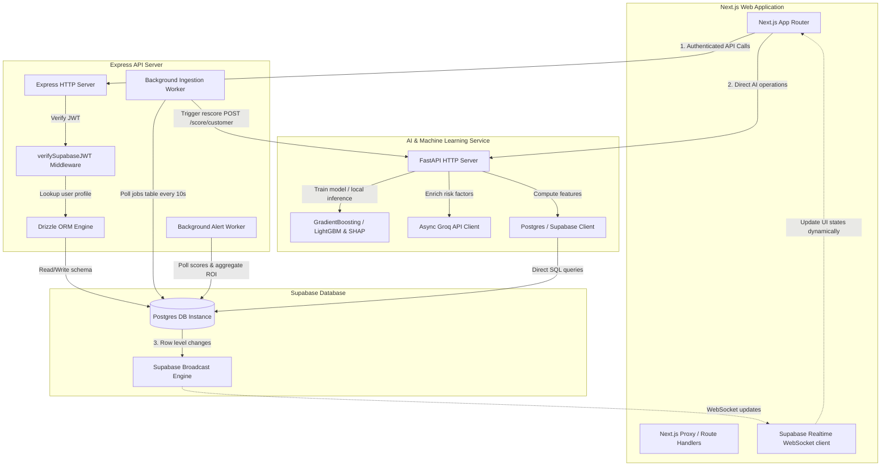

<div align="center">
  

  <p align="center">
    <strong>🔮 State-of-the-Art Enterprise Churn Intelligence & Health-Scoring Platform</strong>
  </p>

  <p align="center">
    <a href="#-system-architecture">Architecture</a> •
    <a href="#-core-technical-capabilities">Capabilities</a> •
    <a href="#-directory-structure">Directory Structure</a> •
    <a href="#-workspace-setup--local-execution">Setup Guide</a> •
    <a href="#-testing--verification">Testing</a> •
    <a href="#-security-compliance--privacy">Security & Compliance</a> •
    <a href="CONTRIBUTING.md">Contributing</a> •
    <a href="CHANGELOG.md">Changelog</a>
  </p>

  <p align="center">
    
    
    
    
    
  </p>
</div>

---

## 🔮 Overview

RetentIQ is an enterprise-grade SaaS customer churn-intelligence and health-scoring platform. It empowers Customer Success (CS) and Account Management teams by predicting customer churn risks 30–60 days before they happen. The system combines a local **Gradient Boosting & LightGBM Machine Learning Classifier** with **SHAP explanations** (telemetry-based quantitative scoring grounded in model computation) and **Llama-3.3 LLM Qualitative Analysis** (natural language risk factors and dynamic playbooks via Groq) to deliver highly actionable account recovery strategies.

RetentIQ is architected as a type-safe, high-performance monorepo:

- **Next.js 16+ (App Router)**: A performant, responsive frontend utilizing Turbopack, Framer Motion, and Tailwind CSS.
- **Node.js Express API Server**: An ESM-based, type-safe API backend using Drizzle ORM.
- **FastAPI AI Microservice**: A high-throughput Python service executing ML inference and LLM orchestrations.
- **Supabase (PostgreSQL)**: Robust data persistence backed by Row Level Security (RLS) and real-time subscription broadcasts.

For machine learning architecture, feature taxonomy, and reproducibility details, see:

- [Model Card](docs/MODEL_CARD.md)
- [Reproducibility Guide](docs/REPRODUCIBILITY.md)

---

## 🏗️ System Architecture

The diagram below illustrates the real-time communication flow across the full-stack architecture layers:


```mermaid
graph TD
    %% Frontend Layer
    subgraph Frontend [Next.js Web Application]
        NextApp[Next.js App Router]
        ProxyRules[Next.js Proxy / Route Handlers]
        RealTimeClient[Supabase Realtime WebSocket client]
    end

    %% Backend Service Layer
    subgraph NodeAPI [Express API Server]
        ExpServer[Express HTTP Server]
        AuthJWT[verifySupabaseJWT Middleware]
        IngWorker[Background Ingestion Worker]
        AlWorker[Background Alert Worker]
        Drizzle[Drizzle ORM Engine]
    end

    %% Python AI Layer
    subgraph PyAI [AI & Machine Learning Service]
        FastAPI[FastAPI HTTP Server]
        LightGBM[GradientBoosting / LightGBM & SHAP]
        GroqClient[Async Groq API Client]
        PyDBCompat[Postgres / Supabase Client]
    end

    %% Database Layer
    subgraph DataStore [Supabase Database]
        Postgres[(Postgres DB Instance)]
        RealtimeBroadcast[Supabase Broadcast Engine]
    end

    %% Communication Flow
    NextApp -->|1. Authenticated API Calls| ExpServer
    NextApp -->|2. Direct AI operations| FastAPI

    ExpServer -->|Verify JWT| AuthJWT
    AuthJWT -->|Lookup user profile| Drizzle
    Drizzle -->|Read/Write schema| Postgres

    IngWorker -->|Poll jobs table every 10s| Postgres
    IngWorker -->|Trigger rescore POST /score/customer| FastAPI
    AlWorker -->|Poll scores & aggregate ROI| Postgres

    FastAPI -->|Compute features| PyDBCompat
    PyDBCompat -->|Direct SQL queries| Postgres
    FastAPI -->|Train model / local inference| LightGBM
    FastAPI -->|Enrich risk factors| GroqClient

    Postgres -->|3. Row level changes| RealtimeBroadcast
    RealtimeBroadcast -.->|WebSocket updates| RealTimeClient
    RealTimeClient -.->|Update UI states dynamically| NextApp
```

---

## 📁 Monorepo Layout

```
RetentIQ/
├── apps/
│   ├── api/                  # Express REST API Server (Node 20, TypeScript, Drizzle)
│   ├── web/                  # Next.js App Router UI (React 19, TailwindCSS, Framer Motion)
│   │   └── src/app/dashboard/integrations/components/  # Modular integrations subcomponents
│   └── ai-service/           # FastAPI Machine Learning Service
│       ├── routers/          # Modular FastAPI routers (scoring, explain, playbook, legacy)
│       ├── classifier.py     # Gradient Boosting & LightGBM churn classifier
│       ├── feature_engine.py # 12-dimensional telemetry feature extractor
│       ├── scoring.py        # Health score clamping, weights, and fallbacks
│       ├── prompts.py        # Dynamic lexicon and LLM prompt templates
│       ├── services.py       # Groq and Supabase service clients with DI
│       └── tests/            # Pytest test suite (31 tests)
├── packages/
│   ├── db/                   # Database migrations, schema, and seed utilities
│   └── shared/               # Shared types, validation schemas, and constants
├── docs/
│   ├── MODEL_CARD.md         # Detailed machine learning model card
│   └── REPRODUCIBILITY.md    # Model seed and environment reproducibility guide
├── .github/
│   ├── dependabot.yml        # Grouped monthly dependency upgrade configuration
│   └── workflows/
│       ├── ci.yml            # Automated CI pipeline (lint, typecheck, web/api/ai tests)
│       └── security-scan.yml # Security vulnerability audit (pnpm audit, pip-audit, gitleaks)
├── .env.example              # Environment variable template
├── CHANGELOG.md              # Historical change record
└── CONTRIBUTING.md           # Developer onboarding and contribution guidelines
```

---

## 🛠️ Workspace Setup & Local Execution

### 1. Prerequisites

- Node.js 20 LTS
- pnpm 10+
- Python 3.11+

### 2. Install Dependencies

```bash
# Monorepo dependencies
pnpm install

# Python AI microservice dependencies
cd apps/ai-service
python -m venv .venv
# On Windows: .venv\Scripts\activate
# On Linux/macOS: source .venv/bin/activate
pip install -r requirements.txt
cd ../..
```

### 3. Environment Configuration

Copy the template configuration and set your local credentials:

```bash
cp .env.example .env
```

### 4. Running Locally

```bash
# Run web and api in parallel
pnpm dev

# In a separate terminal, run the AI microservice
cd apps/ai-service
python main.py
```

- Web UI: `http://localhost:3000`
- API Server: `http://localhost:4000/api`
- AI Microservice: `http://localhost:8000`
- AI Service Docs: `http://localhost:8000/docs`

---

## 🧪 Testing & Verification

RetentIQ includes automated unit and integration tests across all frontend, backend, and machine learning components:

```bash
# 1. Typecheck the entire monorepo
pnpm typecheck

# 2. Run web frontend tests (Vitest + JSDOM)
pnpm test:web

# 3. Run API backend tests (Vitest + Supertest)
pnpm test:api

# 4. Run AI microservice tests (Pytest + AsyncIO)
pnpm test:ai
# or:
pytest apps/ai-service/tests

# 5. Full workspace verification & test coverage
pnpm test
pnpm test:coverage
pnpm build
```

---

## 🔒 Security & Governance

- **Row-Level Security (RLS)**: Enforces multi-tenant data isolation at the PostgreSQL layer.
- **Application-Layer Encryption**: Sensitive credentials (e.g. Stripe, Mixpanel, Slack webhooks) are encrypted at rest using AES-256-GCM.
- **No PII Transmitted to LLMs**: Data sent to Groq is strictly pseudonymized telemetry.
- **Controlled Dependencies**: Automated PR limits, grouped updates, and pinned container images prevent production disruptions.
